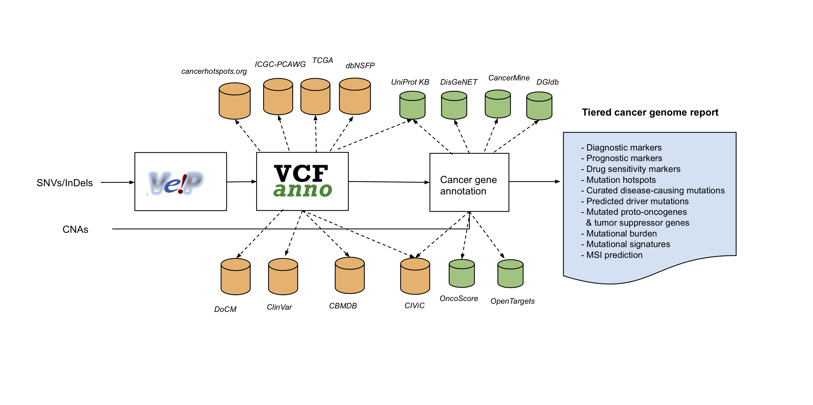

## About

###  What is the Personal Cancer Genome Reporter (PCGR)?

The Personal Cancer Genome Reporter (PCGR) is a stand-alone software package intended for analysis and clinical interpretation of individual cancer genomes. It interprets both somatic SNVs/InDels and copy number aberrations. The software extends basic gene and variant annotations from the [Ensembl’s Variant Effect Predictor (VEP)](http://www.ensembl.org/info/docs/tools/vep/index.html) with oncology-relevant, up-to-date annotations retrieved flexibly through [vcfanno](https://github.com/brentp/vcfanno), and produces HTML reports that can be navigated by clinical oncologists (Figure 1).

The Personal Cancer Genome Reporter has been developed by scientists affiliated with the [Norwegian Cancer Genomics Consortium](http://cancergenomics.no), at the [Institute for Cancer Research/Oslo University Hospital](http://radium.no).

### Why use PCGR?

The great complexity of acquired mutations in individual tumor genomes poses a severe challenge for clinical interpretation. There is a general scarcity of tools that can _i)_ systematically interrogate cancer genomes in the context of diagnostic, prognostic, and therapeutic biomarkers, _ii)_ prioritize and highlight the most important findings, and _iii)_ present the results in a format  accessible to clinical experts. PCGR integrates a comprehensive set of knowledge resources related to tumor biology and therapeutic biomarkers, both at the gene and variant level. The application generates a tiered report that will aid the interpretation of individual cancer genomes in a clinical setting.

### Docker-based technology

The PCGR workflow is developed using the [Docker technology](https://www.docker.com/what-docker). The software is thus packaged into isolated containers, in which the installation of all software libraries/tools and required dependencies have been taken care of. In addition to the bundled software, in the form of a Docker image, the workflow only needs to be attached with an [annotation data bundle for precision oncology](annotation_resources.html).

